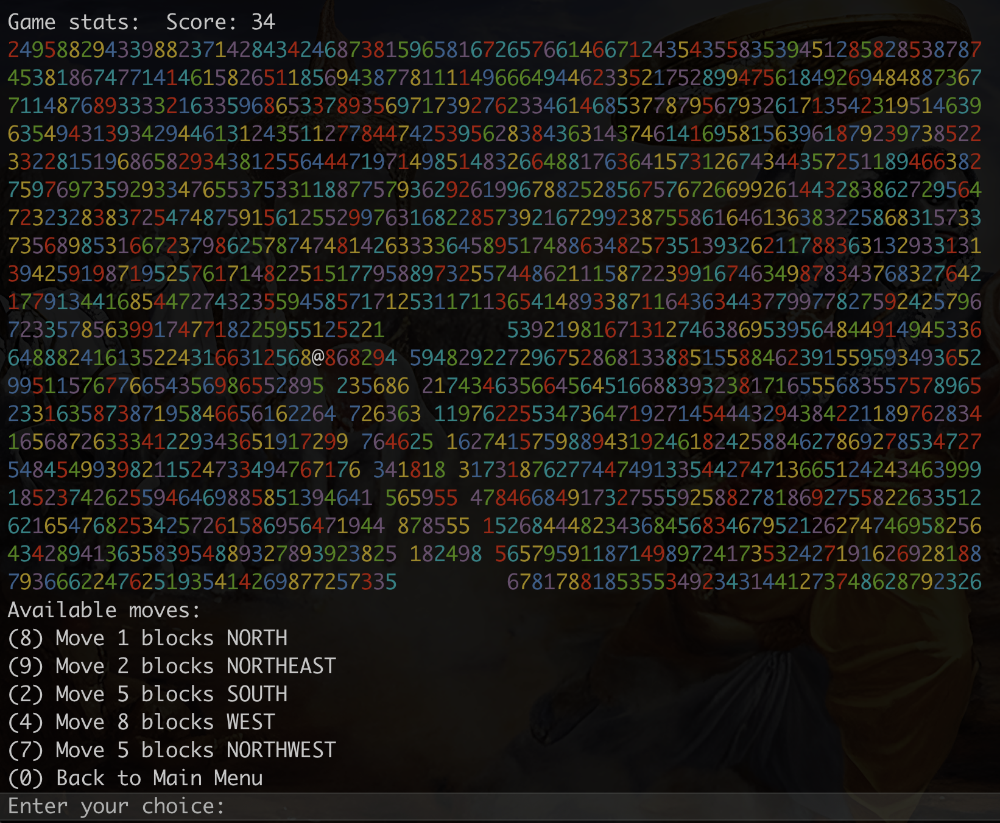
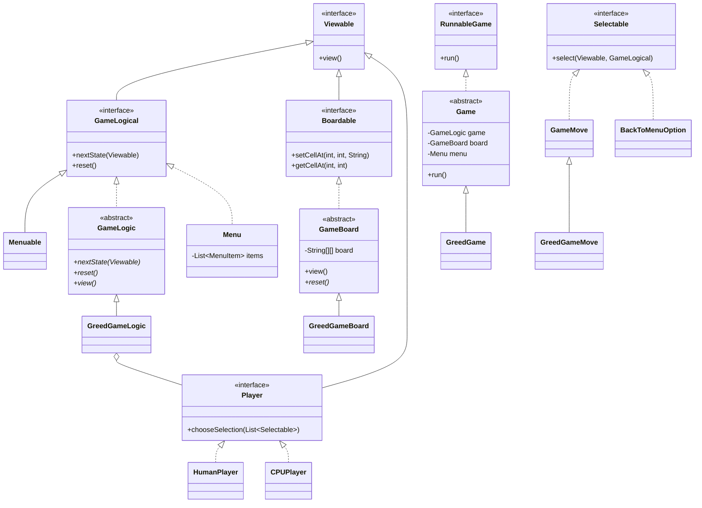
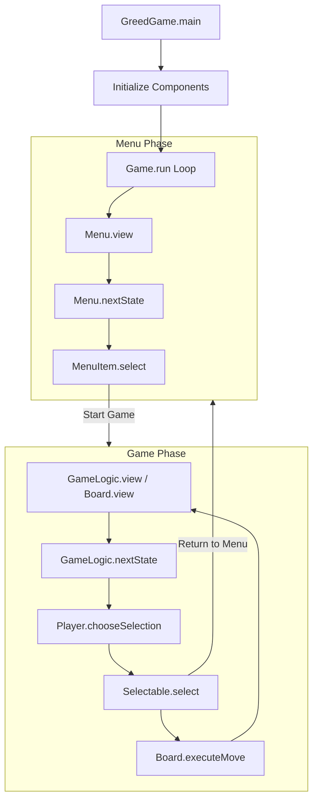
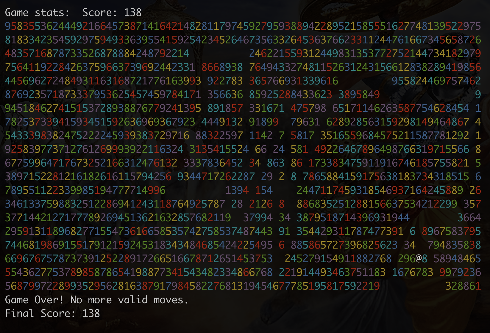

# Greed Game

A terminal-based implementation of the classic "Greed" game, where you navigate a board to collect numbers and maximize your score.


*Welcome to the Greed Game! Set up your player and get ready to play.*

## How to Play

To play the game, use this command in your terminal:

```bash
make play
```

This will automatically compile the source files and launch the application.

### Game Modes

| Mode | Description |
| :--- | :--- |
| **Computer Mode** | Watch the CPU play with random but valid moves until no more moves are available. |
| **Human Mode (Easy)** | Play yourself with helpful hints showing all valid moves available to you. |
| **Human Mode (Regular)** | The ultimate challenge. No hints: you must calculate your own moves. |

### Gameplay Mechanics
- **Objective**: Collect as many numbers as possible.
- **Movement**: Move in any of the 8 cardinal/diagonal directions.
- **Distance**: The number you land on determines how far you must move in that direction (if you land on a 5, your next move must be exactly 5 spaces).
- **Restrictions**: You cannot move through empty spaces or outside the board boundaries.


*Navigating the board. The colored numbers represent valid values you can collect.*

## Architecture and Design

The project follows a clean, object-oriented design using interfaces and abstract classes to separate concerns between game logic, board representation, and player interaction.

### Class Hierarchy
The following diagram illustrates the relationship between the various components of the game:



### Data Flow
This diagram shows how the main game loop coordinates between the menu, game logic, and player input:



## End of Game
The game ends when there are no more valid moves available for the player in any direction.


*Game over screen showing the final state and score.*

## Development Details

### Features
- **Colorized UI**: Numbers on the board are colorized for better visibility and a modern feel.
- **Flexible Architecture**: The core logic is decoupled from the specific Greed game implementation, allowing for easy expansion.
- **Dual Play Modes**: Supports both human players and an automated CPU player.
